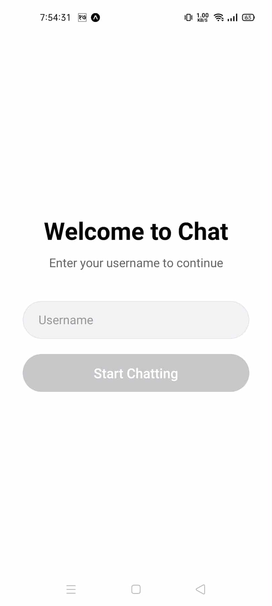
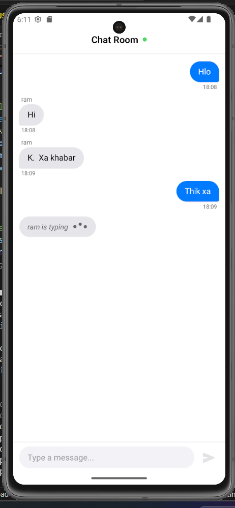

# 📱 Real-Time Chat Application with React Native & WebSocket

A modern, real-time chat application built with React Native Expo and WebSocket technology. Features include live messaging, typing indicators, and a beautiful UI with message bubbles.


## ✨ Features

- 🔐 **User Authentication** - Simple username-based login
- 💬 **Real-time Messaging** - Instant message delivery via WebSocket
- ⌨️ **Typing Indicators** - See when other users are typing
- 🎨 **Beautiful UI** - Distinct message bubbles for sender/receiver
- ⏰ **Timestamps** - Message timestamps with formatted time
- 👤 **User Identification** - Display usernames for each message
- 🔄 **Auto-reconnection** - Automatic WebSocket reconnection on disconnect
- 📱 **Cross-platform** - Works on iOS, Android, and Web
- 🎯 **Optimized Performance** - Efficient rendering with FlatList

## 🖼️ Screenshots

<details>
<summary>Click to view screenshots</summary>

### Login Screen



### Chat Screen



</details>

## 🛠️ Tech Stack

### Frontend

- **React Native** - Mobile application framework
- **Expo** - Development platform
- **React Navigation** - Navigation library
- **React Context API** - State management
- **date-fns** - Date formatting

### Backend

- **Node.js** - JavaScript runtime
- **WebSocket (ws)** - Real-time communication

## 📋 Prerequisites

Before you begin, ensure you have the following installed:

- **Node.js** (v14 or higher)
- **npm** or **yarn**
- **Expo CLI** (`npm install -g expo-cli`)
- **Expo Go** app on your mobile device (for testing)
- **iOS Simulator** (Mac only) or **Android Emulator**

## 🚀 Installation

### 1. Clone the repository

```bash
git clone https://github.com/Grishj/ChatRoom.git
cd chat-app
```

### 2. Install Frontend Dependencies

```bash
# Install React Native dependencies
npm install

# Install navigation dependencies
npm install @react-navigation/native @react-navigation/native-stack

# Install Expo dependencies
npx expo install react-native-screens react-native-safe-area-context expo-constants expo-device

# Install date formatting
npm install date-fns
```

### 3. Install Backend Dependencies

```bash
# Navigate to server directory
cd server

# Initialize package.json (if not exists)
npm init -y

# Install WebSocket
npm install ws

# Install nodemon for development (optional)
npm install --save-dev nodemon

# Return to root directory
cd ..
```

## 📁 Project Structure

```
chat-app/
├── App.js                      # Main application entry point
├── package.json               # Frontend dependencies
├──
├── src/                       # Source code directory
│   ├── components/           # Reusable components
│   │   ├── ChatBubble.js    # Message bubble component
│   │   ├── MessageInput.js  # Input field component
│   │   ├── MessageList.js   # Messages list component
│   │   └── TypingIndicator.js # Typing indicator
│   │
│   ├── screens/              # Application screens
│   │   ├── LoginScreen.js   # User login screen
│   │   └── ChatScreen.js    # Main chat interface
│   │
│   ├── services/             # External services
│   │   └── WebSocketService.js # WebSocket connection manager
│   │
│   ├── context/              # React Context providers
│   │   └── ChatContext.js   # Chat state management
│   │
│   └── utils/                # Utility functions
│       ├── constants.js     # App constants
│       └── helpers.js       # Helper functions
│
├── server/                    # Backend server
│   ├── server.js            # WebSocket server
│   └── package.json         # Server dependencies
│
└── assets/                    # Images, fonts, etc.
```

## ⚙️ Configuration

### WebSocket Server URL

Update the WebSocket URL in `src/context/ChatContext.js`:

```javascript
// For local development
const WS_URL = "ws://localhost:8080";

// For physical device (replace with your IP)
const WS_URL = "ws://192.168.1.100:8080";

// For production
const WS_URL = "wss://your-server.com";
```

### Finding Your Local IP Address

**Mac/Linux:**

```bash
ifconfig | grep inet
```

**Windows:**

```bash
ipconfig
```

## 🎮 Usage

### Starting the Application

#### 1. Start the WebSocket Server

```bash
# Terminal 1
cd server
npm start

# Or with nodemon for auto-restart
npm run dev
```

You should see:

```
🚀 WebSocket server starting...
✅ WebSocket server running on ws://localhost:8080
📝 Waiting for connections...
```

#### 2. Start the React Native App

```bash
# Terminal 2 (new terminal)
npx expo start
```

#### 3. Run on Device/Simulator

- **iOS Simulator:** Press `i`
- **Android Emulator:** Press `a`
- **Physical Device:** Scan QR code with Expo Go app

### Using the Chat Application

1. **Login:** Enter your username on the login screen
2. **Send Messages:** Type in the input field and press send
3. **View Messages:** Messages appear in real-time
4. **Typing Indicator:** Shows when other users are typing
5. **Timestamps:** Each message displays the time sent

## 📡 WebSocket API

### Message Types

#### 1. USER_CONNECTED

```javascript
{
  type: 'USER_CONNECTED',
  userId: 'user_123',
  username: 'John',
  timestamp: '2024-01-01T10:00:00Z'
}
```

#### 2. MESSAGE

```javascript
{
  type: 'MESSAGE',
  id: 'msg_123',
  text: 'Hello, World!',
  userId: 'user_123',
  username: 'John',
  timestamp: '2024-01-01T10:00:00Z'
}
```

#### 3. TYPING

```javascript
{
  type: 'TYPING',
  userId: 'user_123',
  username: 'John'
}
```

#### 4. STOP_TYPING

```javascript
{
  type: 'STOP_TYPING',
  userId: 'user_123',
  username: 'John'
}
```

## 🐛 Troubleshooting

### Common Issues and Solutions

#### 1. WebSocket Connection Failed

- **Issue:** Cannot connect to WebSocket server
- **Solution:**
  - Ensure server is running on port 8080
  - Check firewall settings
  - Use correct IP for physical devices

#### 2. Messages Not Appearing

- **Issue:** Messages sent but not visible
- **Solution:**
  - Check server console for errors
  - Verify WebSocket connection status (green dot)
  - Check browser console for errors

#### 3. Duplicate Messages

- **Issue:** Same message appears twice
- **Solution:**
  - Already handled in the code with duplicate detection
  - Clear app cache if persists

#### 4. Navigation Not Working

- **Issue:** Can't navigate between screens
- **Solution:**

```bash
npm install @react-navigation/native @react-navigation/native-stack
npx expo install react-native-screens react-native-safe-area-context
```

## 🧪 Testing

### Manual Testing Checklist

- [ ] User can enter username and login
- [ ] Messages send and receive in real-time
- [ ] Typing indicator appears when typing
- [ ] Messages show correct timestamps
- [ ] Own messages appear on right (blue)
- [ ] Other messages appear on left (gray)
- [ ] Auto-reconnect works on disconnect
- [ ] App works on iOS and Android

### Testing with Multiple Users

1. Open multiple simulators/devices
2. Login with different usernames
3. Send messages between users
4. Verify real-time delivery

### Development Guidelines

- Follow the existing code style
- Add comments for complex logic
- Update README for new features
- Test on both iOS and Android
- Ensure WebSocket connection is stable
